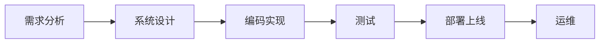
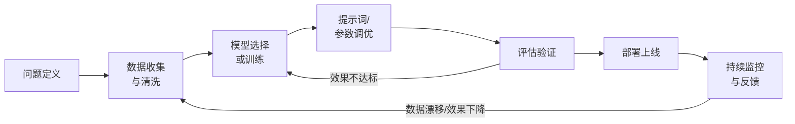

[原文（Notion）](https://www.notion.so/AI-vs-317bf62f93f68039b787ded78d3a394f)

随着大模型（LLM）与传统机器学习（ML）技术的成熟，AI 应用开发正在成为软件行业的新主流。但 AI 应用开发并非简单地"在传统软件里加一个模型"，而是在开发理念、流程、团队、交付、运维、成本等多个维度上都发生了根本性变化。

本文从宏观视角出发，系统梳理 AI 应用开发与传统软件开发的核心差异，并结合 smart_trans（交通事故智能分析系统）的实际项目经验进行说明。

---

## 1. 核心理念：从"确定性"到"概率性"

一句话总结： 传统软件是"你写什么逻辑，它就执行什么逻辑"；AI 应用是"你给什么数据和指令，它给出大概率正确的结果"。

| 维度 | 传统软件开发 | AI 应用开发 |
| --- | --- | --- |
| 核心范式 | 规则驱动（Software 1.0）：开发者显式编写所有业务逻辑 | 数据/模型驱动（Software 2.0）：系统行为由数据 + 模型 + 提示词共同决定 |
| 输出特性 | 确定性——相同输入 → 相同输出 | 概率性——相同输入可能 → 不同输出（模型推理本质是概率采样） |
| 可解释性 | 高：可以逐行追踪代码逻辑 | 低：模型内部是"黑盒"，需要额外手段（如 trace、规则引擎）来增强可解释性 |
| 错误模式 | Bug 是确定的、可复现的 | "错误"可能是概率性的、不稳定的，难以用传统测试手段捕获 |

### 🔍 smart_trans 案例

在 smart_trans 中，我们深刻体会到了这种范式差异，并采用了"关注点分离"的设计来应对：

- LLM（Qwen3-VL）只做事实抽取：输出 17 个结构化可见事实字段（如 collision_evidence、rollover、damage_level 等），这是模型擅长的视觉理解能力
- 本地规则引擎（rag/rules.json）做最终决策：accident_type 和 severity 由确定性规则匹配得出，这是规则擅长的确定性判定能力
> 传统方案的痛点是让 LLM 直接输出"事故类型"和"严重程度"，结果不稳定、不可解释、难复现。通过关注点分离，我们把"概率性"限制在了它擅长的环节，把"确定性"交给了规则引擎。

---

## 2. 开发流程：从"线性瀑布"到"实验迭代"

### 2.1 传统软件开发流程

传统软件遵循相对线性的"需求 → 设计 → 编码 → 测试 → 部署"流程，每个阶段的产出物是明确的。

### 2.2 AI 应用开发流程

AI 应用开发是一个循环往复的实验过程，核心区别在于：

| 维度 | 传统软件 | AI 应用 |
| --- | --- | --- |
| 需求确定性 | 需求边界清晰，可明确定义"完成" | 需求具有探索性——"模型到底能做到多好"往往开发前无法确定 |
| 核心工作 | 编写和组织代码逻辑 | 数据处理 + 模型/提示词调优 + 评估（占 60-80% 工作量） |
| 迭代驱动力 | 功能需求变更 | 模型效果不达标、数据分布变化、新模型发布 |
| 版本管理 | 代码版本（Git） | 代码 + 模型版本 + 数据版本 + 提示词版本（四重版本管理） |

### 🔍 smart_trans 案例

smart_trans 的开发过程就是典型的实验迭代：

1. 模型选择迭代：从单模态到多模态 VL 模型（Qwen3-VL-235B），从单次分析到多次运行聚合（默认 3 次，最多 7 次）降低抖动
1. 提示词迭代：为不同时间帧（t-3s / t-1s / t0）注入不同的上下文提示——前态势 vs 事故发生证据点
1. 规则迭代：rag/rules.json 的 priority、when 条件和 set 值在多轮实验中不断调整
1. 架构迭代：从单图分析 → 三帧并行事件级分析（ingest_triplet），架构随着对问题的理解不断演进
---

## 3. 技术架构：从"代码即全部"到"代码 + 模型 + 数据"三要素

传统软件的交付物主要是代码，而 AI 应用的交付物是代码 + 模型 + 数据三位一体。

| 要素 | 传统软件 | AI 应用（LLM 类） | AI 应用（传统 ML 类） |
| --- | --- | --- | --- |
| 代码 | 业务逻辑、接口、前端 | 编排层、提示词模板、后处理逻辑、规则引擎 | 特征工程、训练脚本、推理服务 |
| 模型 | 无 | API 调用（GPT/Qwen/DeepSeek）或本地部署模型 | 自训练权重文件（.pt / .onnx 等） |
| 数据 | 业务数据（数据库） | 提示词、RAG 知识库、规则库 | 训练集、验证集、测试集、标注数据 |

### 🔍 smart_trans 案例：三要素的具体体现

smart_trans 同时使用了 LLM 和传统 ML，完美展示了三要素的交织：

| 要素 | 具体实现 |
| --- | --- |
| 代码 | FastAPI 后端、React 前端、Pipeline 编排（pipeline_yolo_rag.py）、MCP 工具服务 |
| 模型（LLM） | Qwen3-VL-235B 事实抽取、DeepSeek-V3.2 事件汇总与法规定性 |
| 模型（ML） | YOLOv11 目标检测（交通场景标注增强） |
| 数据/知识 | rag/rules.json（决策规则）、rag/knowledge.md（解释性知识）、rag/law_kb.jsonl（法规知识库） |

---

## 4. 测试与质量保障：从"断言通过"到"效果评估"

这是 AI 应用开发中最具挑战性的差异之一。

| 维度 | 传统软件测试 | AI 应用测试 |
| --- | --- | --- |
| 测试方法 | 单元测试、集成测试、端到端测试 | 评估集（Eval Set）+ 指标体系 + A/B 测试 |
| 通过标准 | 确定性断言：assertEqual(result, expected) | 概率性指标：准确率 ≥ 90%、幻觉率 ≤ 5% |
| 回归测试 | 修改代码后跑测试套件 | 更换模型/提示词后跑评估集，对比指标变化 |
| 边界情况 | 可以穷举关键边界 | 模型行为边界模糊，需要大量多样化样本覆盖 |
| 可复现性 | 高 | 低——即使固定 seed，不同 API 版本/批次也可能给出不同结果 |

### 🔍 smart_trans 的应对策略

- 多次运行聚合：RAG 模式下对同一图片跑 3-7 次，聚合结果降低单次抖动影响
- Trace 落库：将 observations、命中规则、检索片段、原始模型输出全部存入 raw_model_output，支持事后复盘
- 法规引用强约束：law_refs[].quote 必须是检索片段的原文子串，不满足会自动调整并标注修复信息——这是用确定性校验来兜底概率性输出的典型做法
- 失败兜底：即使法规模型调用失败或 KB 为空，也会生成低确定性定性与引用占位，保证链路不断流
---

## 5. 部署与运维：从 DevOps 到 MLOps / LLMOps

| 维度 | 传统软件（DevOps） | AI 应用（MLOps / LLMOps） |
| --- | --- | --- |
| CI/CD 流程 | 代码提交 → 构建 → 测试 → 部署 | 代码/模型/数据任一变更 → 评估 → 部署（三条变更链路） |
| 监控重点 | CPU/内存、接口响应时间、错误率 | 模型输出质量、Token 消耗、延迟、数据漂移、幻觉率 |
| 扩缩容 | 基于请求量 | 基于 GPU 利用率、推理队列长度、Token 吞吐量 |
| 回滚策略 | 回滚代码版本 | 可能需要同时回滚模型版本 + 提示词版本 + 规则版本 |
| 持续改进 | 用户反馈 → 修复 Bug | 用户反馈 → 补充数据/调整提示词/更新知识库 → 重新评估 |

### 🔍 smart_trans 的运维设计

- 异步 Job + 落盘可观测：每个 ingest 请求立即返回 job_id，后台异步执行，所有中间产物（帧级日志、汇总 prompt/response、法规 prompt/response）落盘到 incoming/job_artifacts/
- Schema 自动迁移：ensure_sqlite_schema() 启动时自动补列，适应数据结构快速迭代
- 结果缓存：缓存 Key 由 sha256(image) + rules_version + extractor_version 构成，规则或模型变更时自动失效
---

## 6. 成本结构与商业模式

这是产品/业务侧最关心的差异之一。

| 维度 | 传统软件 | AI 应用 |
| --- | --- | --- |
| 开发成本 | 主要是人力成本（开发者工时） | 人力 + 算力（GPU 训练/推理）+ 数据采集与标注 + API 调用费 |
| 运行成本 | 服务器（CPU/内存为主），可预测 | Token 消耗按量计费（LLM）或 GPU 推理成本（ML），与使用量强相关 |
| 边际成本 | 趋近于零（代码执行几乎无额外成本） | 每次推理都有成本（尤其是大模型 API 调用） |
| 定价模式 | SaaS 订阅 / 买断 | 按用量（Token/次数）+ 订阅混合模式 |
| 成本优化手段 | 代码优化、缓存、CDN | 模型蒸馏、提示词精简、缓存策略、模型切换（贵→便宜） |

### 🔍 smart_trans 的成本考量

- 双模型策略：事实抽取用 Qwen3-VL（视觉能力强），事件汇总用 DeepSeek-V3.2（性价比高）——按任务特性匹配模型，而非一刀切用最贵的
- 结果缓存：相同图片 + 相同规则版本不重复调用模型，直接复用缓存
- 多次运行的成本权衡：3 次聚合 vs 7 次聚合，需要在"稳定性"和"API 成本"之间找平衡
---

## 7. 团队角色与能力要求

AI 应用开发催生了一系列新角色，也改变了传统角色的职责边界。

| 角色 | 传统软件 | AI 应用 |
| --- | --- | --- |
| 产品经理 | 定义功能需求，关注用户体验 | 需理解模型能力边界，定义"可接受的准确率"，设计人机协作流程 |
| 后端开发 | 编写业务逻辑、API、数据库 | 编排层开发（Pipeline / Workflow）、模型集成、RAG 系统 |
| 前端开发 | 界面交互 | 需支持流式输出、不确定性展示（置信度）、人工审核界面 |
| 测试工程师 | 编写测试用例，断言验证 | 构建评估集、设计评估指标、A/B 测试 |
| 🆕 提示词工程师 | 不存在 | 设计和优化提示词、构建 Few-shot 示例、调控模型输出格式与质量 |
| 🆕 数据工程师 | DBA / 数据分析 | 数据采集、清洗、标注、知识库构建与维护 |
| 🆕 ML/AI 工程师 | 不存在 | 模型选型、微调、部署、性能优化 |

一人团队的新可能

  AI 工具（如 Claude Code、OpenCode、Cursor）正在重塑团队结构。在 smart_trans 项目中，一个人就完成了"后端 + 前端 + 模型集成 + 规则引擎 + MCP 工具链 + 可视化看板"的全链路开发。AI 协作工具让"编排层 + 专业智能体"的范式成为可能——人负责架构设计和质量把关，AI 负责代码实现和重复性工作。

---

## 8. 总结对比表

| 对比维度 | 传统软件开发 | AI 应用开发 |
| --- | --- | --- |
| 核心范式 | 规则驱动，确定性 | 数据/模型驱动，概率性 |
| 开发流程 | 线性（需求→交付） | 循环（实验→评估→迭代） |
| 交付物 | 代码 | 代码 + 模型 + 数据/知识 |
| 测试方式 | 确定性断言 | 概率性评估 + 指标体系 |
| 运维模式 | DevOps | MLOps / LLMOps |
| 成本结构 | 人力为主，边际成本低 | 人力 + 算力 + 数据，边际成本显著 |
| 团队角色 | 开发 / 测试 / 运维 | 新增提示词工程、数据工程、模型评估等角色 |
| 可解释性 | 高（代码即逻辑） | 低（需额外手段增强） |
| 适用场景 | 逻辑明确、规则固定的系统 | 模式识别、自然语言、视觉理解等非结构化问题 |

---

## 9. 最佳实践：如何融合两种范式

在实际项目中，AI 应用开发与传统软件开发并非非此即彼，而是需要有机融合。以下是一些经过验证的实践原则：

### ✅ 关注点分离

让 AI 做 AI 擅长的事（感知、理解、生成），让规则做规则擅长的事（确定性决策、合规校验）。smart_trans 的"LLM 事实抽取 + 规则引擎决策"就是这一原则的典型实践。

### ✅ 确定性兜底

永远为 AI 的不确定性设计兜底方案。法规模型调用失败时生成低确定性占位、引用校验不通过时自动修复并标注——链路不能断流。

### ✅ 可观测性优先

AI 系统的调试远比传统软件复杂。每一步的输入、输出、中间状态都应该可追溯。smart_trans 的 trace 落库和 job artifacts 日志就是为此设计。

### ✅ 渐进式引入 AI

不需要一开始就全面 AI 化。可以先用传统方式搭建核心链路，再在关键环节引入 AI 增强。smart_trans 就是从"手动分析图片"逐步演进到"三帧并行自动分析 + 法规自动定性"。

---

## 10. 参考资料与延伸阅读

### 文章与博客

- [AI 应用交付和传统软件有啥不同？一份给开发者的避坑指南](https://modelengine.csdn.net/690c53b15511483559e2b84c.html) — 从 CI/CD 角度对比 AI 与传统应用交付
- [AI 应用开发与传统应用开发有什么区别？一文详解](https://www.betteryeah.com/blog/differences-between-ai-application-development-and-traditional-application-development) — BetterYeah AI，覆盖需求分析、数据依赖、实时性等维度
- [AI Development vs Software Engineering: Key Differences Explained](https://towardsdatascience.com/ai-development-vs-software-engineering-key-differences-explained-0709633e81d2/) — Towards Data Science，含伦理与合规视角
- [AI Product Development vs Software Development: A Strategic Guide](https://www.tribe.ai/applied-ai/ai-product-development-vs-software-development) — Tribe AI，面向业务决策者的战略指南
- [Agentic AI 基础设施实践经验：Agent 应用开发与落地实践思考](https://aws.amazon.com/cn/blogs/china/agentive-ai-infrastructure-practice-series-1/) — AWS 官方博客，Agent 架构四大核心模块解析
### 项目参考

- [smart_trans 项目地址](https://github.com/pmy0721/smart_trans) — 本文案例项目，交通事故智能分析端到端系统
- [smart_trans：从交通事故识别到可视化看板的端到端智能系统](https://www.notion.so/2fdbf62f93f6803483fedb41892dd74a) — 完整代码走读文档
- [smart_trans：ingest_triplet 事件级端到端智能系统](https://www.notion.so/304bf62f93f680d2be54dba59a668809) — 三帧事件级分析详细设计
### 延伸主题

- [智能体软件工程（Agentic Software Engineering）— Ashpreet Bedi](https://www.notion.so/8e87ae3e04e246a692d4bea8c02ed611) — 构建智能体是 AI 工程，在生产环境中运行它是软件工程
- [OpenClaw + Codex/Claude Code 智能体集群：一人开发团队（完整搭建指南）](https://www.notion.so/313bf62f93f680808d0fc321bb26bea1) — AI 协作工具如何重塑开发团队结构
- [Vibe Coding给培训行业带来的思考](https://www.notion.so/2febf62f93f6805b9ee8d362148fbb85) — "AI 协作架构师"与小团队产能形态
