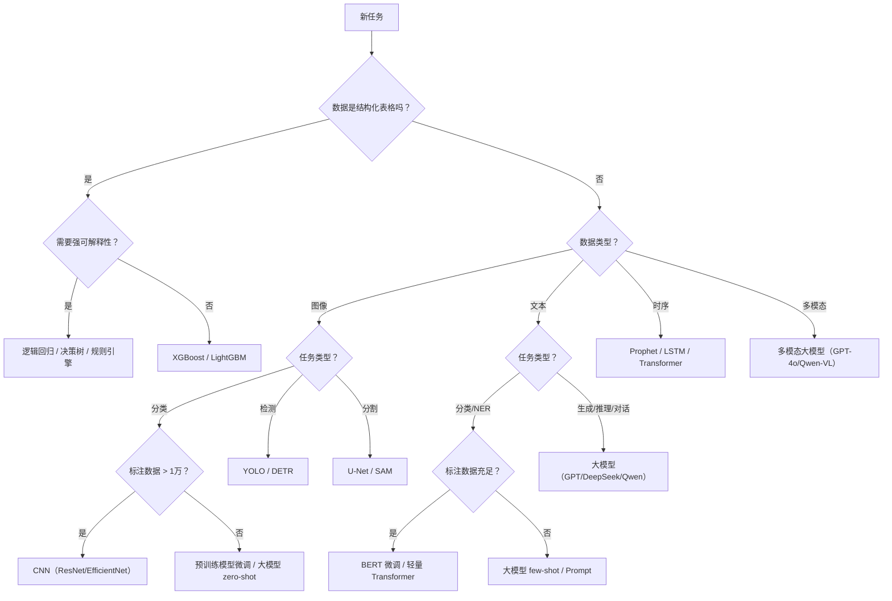

[原文（Notion）](https://www.notion.so/4a071f116c734ec0a4d8d6505f4d4f79)

本文旨在回答三个核心问题：机器学习、深度学习与大模型的本质区别是什么？大模型效果最好，是否意味着所有场景都该用大模型？在特定场景下，应根据哪些要素选择合适的算法方案？

---

## 一、机器学习 · 深度学习 · 大模型：三者关系与核心区别

三者是包含关系，而非并列关系：

> 机器学习 ⊃ 深度学习 ⊃ 大模型（基础模型）

| 维度 | 机器学习（ML） | 深度学习（DL） | 大模型（LLM / Foundation Model） |
| --- | --- | --- | --- |
| 定义 | 从数据中学习规律，无需显式编程 | 用多层神经网络自动学习特征表示 | 超大规模参数的深度模型，经海量数据预训练，具备涌现能力 |
| 典型算法 | 线性回归、SVM、决策树、XGBoost、随机森林、KNN | CNN、RNN/LSTM、Transformer（中小规模）、GAN、U-Net | GPT 系列、DeepSeek、Qwen、LLaMA、CLIP、SAM、Whisper |
| 参数量级 | 数百 ~ 数万 | 数万 ~ 数亿 | 数十亿 ~ 数万亿 |
| 数据需求 | 少量 ~ 中等（百 ~ 万级） | 中等 ~ 大量（万 ~ 百万级） | 海量（十亿 ~ 万亿 token） |
| 特征工程 | 强依赖人工特征设计 | 自动学习特征，但需设计网络结构 | 几乎不需要；通过 Prompt/微调适配 |
| 可解释性 | 高（决策树、线性模型可直接解读） | 低（黑箱，需 Grad-CAM 等辅助） | 极低（涌现行为难以预测和解释） |
| 推理成本 | 极低（CPU 毫秒级） | 中等（GPU 毫秒 ~ 秒级） | 高（GPU 秒级，API 按 token 计费） |
| 核心优势 | 轻量、可解释、数据效率高 | 自动特征学习、处理非结构化数据 | 泛化能力强、少样本/零样本、跨任务迁移 |
| 核心劣势 | 依赖特征工程，难处理复杂非线性 | 需大量标注数据，训练成本高 | 资源消耗大、延迟高、幻觉问题、可控性差 |

### 关键洞察

三者不是替代关系，而是工具箱中不同层级的工具。 深度学习没有淘汰传统 ML，大模型也没有淘汰深度学习。选择哪个层级，取决于任务复杂度、数据条件、资源约束和业务需求的综合权衡。

---

## 二、大模型效果最好，就一定要用大模型吗？

答案是：不一定，甚至在很多场景下不应该。

### 2.1 "大模型效果最好"的前提条件

大模型在以下条件下确实表现优越：

- 任务需要广泛的世界知识（如开放域问答、复杂推理）
- 缺乏大量标注数据，需要零样本或少样本能力
- 任务是生成式的（文本生成、对话、代码编写）
- 需要跨模态、跨任务的统一能力
### 2.2 大模型不是最优解的六个典型场景

| 场景 | 为什么不用大模型 | 更优方案 |
| --- | --- | --- |
| 结构化数据的分类/回归（如信用评分、流失预测） | XGBoost 等 GBDT 在表格数据上持续胜过大模型，且可解释性远优 | XGBoost / LightGBM |
| 实时推理要求极高（如自动驾驶目标检测、边缘端） | 大模型推理延迟 100ms+，无法满足 <10ms 的实时要求 | YOLOv8/v11、MobileNet、TensorRT 加速的轻量 CNN |
| 数据量极少且领域明确（如工业缺陷检测仅百张图） | 小样本微调大模型仍不稳定；传统特征 + 小模型更可靠 | 迁移学习（ResNet/EfficientNet 微调）或传统特征 + SVM |
| 需要强可解释性（如医疗诊断、金融风控、司法） | 监管要求模型决策可审计，大模型黑箱特性不合规 | 逻辑回归、决策树、SHAP 可解释 GBDT |
| 离线/边缘部署、无 GPU | 大模型需 GPU 推理，边缘设备资源受限 | ONNX Runtime 轻量模型、scikit-learn、TFLite |
| 高吞吐批量处理（如日处理千万条数据） | 大模型单条成本高、吞吐低 | 传统 ML 管线、Spark ML、轻量 DL 模型 |

### 2.3 正确的思维方式

不要问"哪个技术最强"，而要问"在我的约束条件下，哪个方案的性价比最高"。

  技术选型的本质是一个多目标优化问题：在精度、延迟、成本、可解释性、可维护性等多个维度上找到帕累托最优解。

---

## 三、算法选型的关键要素框架

在选择算法方案之前，需要系统评估以下 8 个核心要素：

### 3.1 八要素全景

| 要素 | 评估内容 | 影响方向 |
| --- | --- | --- |
| ① 数据规模与质量 | 样本量、标注质量、类别平衡度、噪声水平 | 数据少 → ML/迁移学习；数据多且高质 → DL/大模型 |
| ② 数据类型 | 结构化（表格）、非结构化（图像/文本/音频）、多模态 | 结构化 → ML 优先；非结构化 → DL/大模型优先 |
| ③ 任务类型 | 分类、回归、检测、分割、生成、推理、对话…… | 判别式任务 → ML/DL；生成式/推理 → 大模型 |
| ④ 延迟与吞吐要求 | 实时性（ms/s/min）、QPS、批量 vs 在线 | 实时 → 轻量模型；离线批量 → 可用更重模型 |
| ⑤ 计算资源与成本 | GPU/CPU 可用性、内存、API 预算、长期运营成本 | 资源受限 → ML/轻量 DL；资源充足 → DL/大模型 |
| ⑥ 可解释性需求 | 是否需要审计、合规、向非技术人员解释 | 强可解释 → ML（树模型/线性模型） |
| ⑦ 迭代速度与维护成本 | 团队规模、上线周期、模型更新频率 | 快速迭代/小团队 → ML 或 API 调用大模型 |
| ⑧ 精度兜底与容错 | 错误的业务代价、是否需要人工复核 | 高代价错误 → 可解释 ML + 规则兜底；容错高 → DL/大模型 |

### 3.2 快速决策流程图

---

## 四、按场景逐一说明：如何选型

### 4.1 图像分类

> 给一张图打标签：是猫还是狗？是良品还是次品？

| 条件 | 推荐方案 | 理由 | 典型模型 |
| --- | --- | --- | --- |
| 标注数据 > 1 万，类别清晰 | CNN 从头训练或微调 | 数据充足时 CNN 精度高、推理快、部署简单 | ResNet-50、EfficientNet-B0~B7、ConvNeXt |
| 标注数据 < 1000 | 预训练模型微调 | 利用 ImageNet 预训练权重迁移，小数据也能收敛 | ResNet + 冻结前层微调、CLIP zero-shot |
| 类别开放/未知 | 多模态大模型 | 无需预定义类别，零样本分类 | CLIP、GPT-4o、Qwen-VL |
| 边缘设备部署 | 轻量 CNN | 模型小、推理快、CPU 可跑 | MobileNetV3、ShuffleNet、TFLite 量化 |

---

### 4.2 目标检测

> 图中有哪些物体？分别在哪里？

| 条件 | 推荐方案 | 理由 | 典型模型 |
| --- | --- | --- | --- |
| 实时检测（<20ms） | YOLO 系列 | 单阶段检测器，速度与精度平衡最佳 | YOLOv8、YOLOv11、YOLO-World |
| 高精度优先、非实时 | Transformer 检测器 | 端到端，无需 NMS 后处理，大物体精度高 | DETR、DINO、Co-DETR |
| 开放词汇检测（未见过的类别） | 视觉-语言模型 | 文本描述即可检测新类别，无需重新标注训练 | Grounding DINO、YOLO-World、OWLv2 |
| 标注极少（<100 张） | 大模型辅助标注 + 小模型训练 | 大模型生成伪标注 → 训练轻量检测器 | GPT-4o 标注 → YOLOv8 训练 |

---

### 4.3 语义分割

> 图中每个像素属于什么类别？

| 条件 | 推荐方案 | 理由 | 典型模型 |
| --- | --- | --- | --- |
| 医学影像（CT/MRI/病理） | U-Net 家族 | 跳接连接保留细节，医学领域 SOTA 基线 | U-Net、nnU-Net、Swin-UNETR |
| 通用场景分割 | Transformer 分割器 | 全局上下文建模强，复杂场景精度高 | SegFormer、Mask2Former |
| 零样本/交互式分割 | 基础分割模型 | 一次训练、万物可分割 | SAM（Segment Anything）、SAM 2 |
| 实时分割（自动驾驶） | 轻量分割网络 | 满足帧率要求 | BiSeNet、DDRNet、PP-LiteSeg |

---

### 4.4 文本分类

> 这条评论是正面还是负面？这封邮件属于哪个部门？

| 条件 | 推荐方案 | 理由 | 典型模型 |
| --- | --- | --- | --- |
| 标注充足 + 类别固定 | BERT 微调 | 分类精度高，推理速度可控，部署成熟 | BERT-base、RoBERTa、DeBERTa |
| 数据极少 / 类别动态变化 | 大模型 Prompt | 零样本或少样本即可工作 | GPT-4、DeepSeek、Qwen |
| 高吞吐批量处理（百万级/天） | TF-IDF + 传统 ML | 极快、成本几乎为零 | TF-IDF + SVM / LightGBM |
| 需要可解释性 | 规则引擎 + 关键词 | 完全透明，可审计 | 正则匹配、关键词词典、朴素贝叶斯 |

---

### 4.5 命名实体识别（NER）

> 从文本中抽取人名、地名、机构名、金额等实体。

| 条件 | 推荐方案 | 理由 | 典型模型 |
| --- | --- | --- | --- |
| 实体类型固定，标注充足 | BERT + CRF / Span 抽取 | 序列标注精度高，推理快 | BERT-CRF、GlobalPointer、W2NER |
| 实体类型动态 / 无标注 | 大模型抽取 | 通过 Prompt 定义实体类型，灵活适配 | GPT-4、DeepSeek（结构化输出） |
| 简单实体（手机号/邮箱/日期） | 正则表达式 | 确定性高、零成本、零延迟 | Python re 模块 |

---

### 4.6 文本生成与对话

> 写文章、写代码、客服对话、知识问答。

| 条件 | 推荐方案 | 理由 | 典型模型 |
| --- | --- | --- | --- |
| 开放域生成 / 复杂推理 | 大模型 API | 生成质量与推理能力目前无替代方案 | GPT-4o、DeepSeek-V3、Qwen-Max |
| 领域知识问答 | 大模型 + RAG | 检索增强减少幻觉，保证知识时效性 | 大模型 + 向量检索（如 Milvus/Chroma） |
| 固定话术客服 | 检索式对话 + 规则兜底 | 可控性高、成本低、无幻觉风险 | ES/向量检索 + 意图分类模型 |
| 私有化部署 / 数据安全 | 开源大模型本地部署 | 数据不出域，可定制微调 | Qwen-72B、DeepSeek-67B、LLaMA-3-70B + vLLM |

---

### 4.7 结构化数据分类

> 根据用户画像预测是否会流失、是否会点击广告。

| 条件 | 推荐方案 | 理由 | 典型模型 |
| --- | --- | --- | --- |
| 通用场景（首选） | GBDT 家族 | 表格数据之王，Kaggle 竞赛持续称霸 | XGBoost、LightGBM、CatBoost |
| 需要可解释性 | 逻辑回归 / 决策树 | 系数或路径可直接解读 | sklearn LogisticRegression、DecisionTree |
| 特征间存在复杂交互 | 深度表格模型 | 自动学习特征交叉 | TabNet、FT-Transformer、TabTransformer |
| 超大规模数据（亿级） | 分布式 ML | 单机放不下，需分布式训练 | Spark MLlib、Vowpal Wabbit、H2O |

重要提醒： 多项研究与 Kaggle 实战表明，在结构化表格数据上，XGBoost/LightGBM 仍然优于大模型和深度表格模型。不要因为大模型流行就忽视传统 GBDT 的统治地位。

---

### 4.8 结构化数据回归

> 预测房价、销售额、库存需求量。

| 条件 | 推荐方案 | 理由 | 典型模型 |
| --- | --- | --- | --- |
| 通用场景 | GBDT 回归 | 非线性拟合强、鲁棒性好 | XGBoost Regressor、LightGBM Regressor |
| 线性关系为主 | 线性/岭/Lasso 回归 | 简单、快速、可解释 | sklearn Ridge、Lasso、ElasticNet |
| 高维稀疏数据 | Lasso / ElasticNet | 自动特征选择，稀疏解 | sklearn Lasso |

---

### 4.9 时序预测

> 预测未来 7 天的销量、股价走势、服务器负载。

| 条件 | 推荐方案 | 理由 | 典型模型 |
| --- | --- | --- | --- |
| 单变量、趋势+季节性 | 统计模型 | 简单可靠，可解释性强 | Prophet、ARIMA、ETS |
| 多变量、复杂时间依赖 | 深度时序模型 | 自动捕获非线性时序特征 | LSTM、Temporal Fusion Transformer、PatchTST、iTransformer |
| 超长期预测（>30 步） | Transformer 时序模型 | 长距离依赖建模能力强 | PatchTST、TimesNet、TimesFM |
| 零样本 / 跨域迁移 | 时序基础模型 | 预训练于大规模时序数据 | TimesFM（Google）、Chronos（Amazon）、Moirai |

---

### 4.10 推荐系统

> 给用户推荐商品、内容、好友。

| 条件 | 推荐方案 | 理由 | 典型模型 |
| --- | --- | --- | --- |
| 冷启动 / 内容驱动 | 内容过滤 + Embedding | 无需用户行为数据 | TF-IDF + 余弦相似度、Sentence-BERT |
| 用户行为数据充足 | 协同过滤 + 深度排序 | 利用群体行为模式 | 矩阵分解、DeepFM、DIN、DIEN |
| 多目标优化（点击+转化+留存） | 多任务学习 | 同时优化多个业务目标 | MMOE、PLE、ESMM |
| 对话式推荐 / 长尾探索 | 大模型 + 推荐系统 | 自然语言理解用户意图 | 大模型做意图理解 → 推荐引擎做召回排序 |

---

### 4.11 多模态理解

> 图文混合理解、视频理解、文档 OCR + 理解。

| 条件 | 推荐方案 | 理由 | 典型模型 |
| --- | --- | --- | --- |
| 图文理解（通用） | 多模态大模型 | 统一架构处理图文，目前最佳方案 | GPT-4o、Qwen-VL、DeepSeek-VL |
| 文档 OCR + 结构化提取 | OCR + 大模型管线 | OCR 保证识别精度，大模型做结构化理解 | PaddleOCR / DeepSeek-OCR → 大模型解析 |
| 图文检索 / 匹配 | 对比学习模型 | 高效的跨模态 Embedding | CLIP、SigLIP、Chinese-CLIP |
| 视频理解 | 视频多模态模型 | 时序 + 视觉 + 语言联合建模 | GPT-4o（视频输入）、Qwen-VL-Max、InternVL |

---

### 4.12 异常检测

> 检测欺诈交易、设备异常、网络入侵。

| 条件 | 推荐方案 | 理由 | 典型模型 |
| --- | --- | --- | --- |
| 无标签 / 极少异常样本 | 无监督异常检测 | 无需异常标注，学习正常模式 | Isolation Forest、LOF、AutoEncoder |
| 有标注的二分类 | GBDT + 过采样 | 处理不平衡数据效果好 | XGBoost + SMOTE、LightGBM + focal loss |
| 时序异常 | 时序异常模型 | 捕获时间维度的异常模式 | LSTM-AE、Transformer-AE、统计控制图 |

---

### 4.13 聚类与降维

> 客户分群、数据探索、特征压缩。

| 条件 | 推荐方案 | 理由 | 典型模型 |
| --- | --- | --- | --- |
| 已知簇数、球形簇 | K-Means | 简单快速，可扩展到大数据 | sklearn KMeans、MiniBatchKMeans |
| 任意形状簇、含噪声 | 密度聚类 | 自动发现簇数，可识别噪声点 | DBSCAN、HDBSCAN、OPTICS |
| 高维数据可视化 | 降维 + 可视化 | 将高维数据投影到 2D/3D | t-SNE、UMAP、PCA |
| 语义级聚类（文本/图像） | Embedding + 聚类 | 先用大模型/BERT 提取语义向量，再聚类 | Sentence-BERT → HDBSCAN |

---

## 五、混合架构：现实中的最佳实践

在真实项目中，很少只用单一技术，最常见的是混合管线：

### 5.1 经典混合模式

大模型做理解 + 小模型做执行

  - 大模型负责语义理解、意图解析、知识推理
  - 小模型/传统 ML 负责高频、低延迟的执行任务
  示例： 在 smart_trans 中，大模型（DeepSeek）做事故原因分析与法规定性推理，YOLO 做实时目标检测，RAG + 规则引擎做法规检索与引用校验——三者各司其职。

### 5.2 其他常见组合

- 大模型生成标注 → 小模型训练部署（降低标注成本）
- 规则引擎前置过滤 → ML/DL 模型精排（提升效率与可控性）
- 大模型做冷启动 → 积累数据后切换专用模型（渐进式演进）
- Embedding 统一表征 → 下游接不同模型（灵活适配）
---

## 六、一页纸总结

|  | 选 ML | 选 DL | 选大模型 |
| --- | --- | --- | --- |
| 数据 | 少量 / 结构化 | 中大量 / 非结构化 | 极少标注 / 需零样本 |
| 任务 | 分类/回归/聚类 | 检测/分割/序列标注 | 生成/推理/对话/跨任务 |
| 延迟 | μs ~ ms 级 | ms ~ 百 ms 级 | 百 ms ~ 秒级 |
| 成本 | 极低（CPU 即可） | 中等（需 GPU） | 高（GPU 集群 / API 费用） |
| 可解释 | ✅ 高 | ⚠️ 中低 | ❌ 低 |
| 适合谁 | 快速验证 / 资源受限 / 合规场景 | 有 GPU + 标注数据的团队 | 需要泛化能力与生成能力的场景 |

最终建议：永远从最简单、最便宜的方案开始，逐步升级。

  1. 先用规则/启发式建立 baseline
  1. 再尝试传统 ML（XGBoost 等）
  1. 如果效果不够，上 DL 专用模型
  1. 只有在确实需要泛化/生成/推理能力时，才引入大模型
  1. 最终形态往往是混合管线，各取所长
---

## 七、参考资料

### 基础理论与综述

1. Goodfellow, I., Bengio, Y., & Courville, A. (2016). Deep Learning. MIT Press. — 深度学习领域经典教材，系统阐述 ML → DL 的层级关系与核心方法。
1. Bishop, C. M. (2006). Pattern Recognition and Machine Learning. Springer. — 机器学习数学基础与经典算法的权威参考。
1. Bommasani, R. et al. (2021). "On the Opportunities and Risks of Foundation Models." arXiv:2108.07258. — 首次系统定义"基础模型（Foundation Model）"概念，分析大模型的能力边界与风险。
### 大模型与 Transformer 架构

1. Vaswani, A. et al. (2017). "Attention Is All You Need." NeurIPS 2017. — Transformer 架构开山之作，所有大模型的基石。
1. Brown, T. et al. (2020). "Language Models are Few-Shot Learners." NeurIPS 2020. — GPT-3 论文，展示大模型涌现的少样本/零样本能力。
1. Touvron, H. et al. (2023). "LLaMA: Open and Efficient Foundation Language Models." arXiv:2302.13971. — Meta 开源大模型，推动开源社区发展。
1. DeepSeek-AI. (2024). "DeepSeek-V2: A Strong, Economical, and Efficient Mixture-of-Experts Language Model." arXiv:2405.04434. — MoE 架构在大模型效率上的代表性工作。
### 表格数据与 GBDT

1. Chen, T. & Guestrin, C. (2016). "XGBoost: A Scalable Tree Boosting System." KDD 2016. — XGBoost 原始论文，结构化数据建模的基准方法。
1. Ke, G. et al. (2017). "LightGBM: A Highly Efficient Gradient Boosting Decision Tree." NeurIPS 2017. — LightGBM 论文，大规模表格数据高效训练。
1. Grinsztajn, L., Oyallon, E., & Varoquaux, G. (2022). "Why do tree-based models still outperform deep learning on typical tabular data?" NeurIPS 2022. — 实证分析树模型在表格数据上仍优于深度学习的原因。
1. Gorishniy, Y. et al. (2021). "Revisiting Deep Learning Models for Tabular Data." NeurIPS 2021. — FT-Transformer 等深度表格模型的对比研究。
### 目标检测与图像分割

1. Redmon, J. et al. (2016). "You Only Look Once: Unified, Real-Time Object Detection." CVPR 2016. — YOLO 系列开山之作。
1. Carion, N. et al. (2020). "End-to-End Object Detection with Transformers (DETR)." ECCV 2020. — Transformer 端到端目标检测。
1. Kirillov, A. et al. (2023). "Segment Anything." ICCV 2023. — SAM 通用分割基础模型。
1. Ronneberger, O., Fischer, P., & Brox, T. (2015). "U-Net: Convolutional Networks for Biomedical Image Segmentation." MICCAI 2015. — 医学影像分割经典架构。
### NLP 与文本理解

1. Devlin, J. et al. (2019). "BERT: Pre-training of Deep Bidirectional Transformers for Language Understanding." NAACL 2019. — BERT 预训练范式，文本分类/NER 的基线模型。
1. Lewis, P. et al. (2020). "Retrieval-Augmented Generation for Knowledge-Intensive NLP Tasks." NeurIPS 2020. — RAG 检索增强生成的开创性工作。
### 多模态

1. Radford, A. et al. (2021). "Learning Transferable Visual Models From Natural Language Supervision (CLIP)." ICML 2021. — 图文对比学习的里程碑工作。
1. OpenAI. (2024). "GPT-4o System Card." — 多模态统一模型的能力与安全性报告。
### 时序预测

1. Nie, Y. et al. (2023). "A Time Series is Worth 64 Words: Long-term Forecasting with Transformers (PatchTST)." ICLR 2023. — Transformer 时序预测的代表性工作。
1. Das, A. et al. (2024). "A Decoder-only Foundation Model for Time-Series Forecasting (TimesFM)." ICML 2024. — Google 时序基础模型。
### 推荐系统

1. Guo, H. et al. (2017). "DeepFM: A Factorization-Machine based Neural Network for CTR Prediction." IJCAI 2017. — 深度推荐模型经典方法。
1. Zhou, G. et al. (2018). "Deep Interest Network for Click-Through Rate Prediction (DIN)." KDD 2018. — 注意力机制在推荐中的应用。
### 异常检测与聚类

1. Liu, F. T., Ting, K. M., & Zhou, Z.-H. (2008). "Isolation Forest." ICDM 2008. — 无监督异常检测经典算法。
1. McInnes, L., Healy, J., & Melville, J. (2018). "UMAP: Uniform Manifold Approximation and Projection for Dimension Reduction." arXiv:1802.03426. — 高维可视化与降维的主流方法。
### 模型可解释性

1. Lundberg, S. M. & Lee, S.-I. (2017). "A Unified Approach to Interpreting Model Predictions (SHAP)." NeurIPS 2017. — 模型可解释性的统一框架。
1. Selvaraju, R. R. et al. (2017). "Grad-CAM: Visual Explanations from Deep Networks via Gradient-based Localization." ICCV 2017. — 深度学习可视化解释方法。
### 算法选型方法论

1. Wolpert, D. H. (1996). "The Lack of A Priori Distinctions Between Learning Algorithms (No Free Lunch Theorems)." Neural Computation. — "没有免费午餐"定理，选型需因场景而异的理论基础。
1. scikit-learn. "Choosing the right estimator." scikit-learn Documentation. — 经典 ML 算法选型决策流程图。
